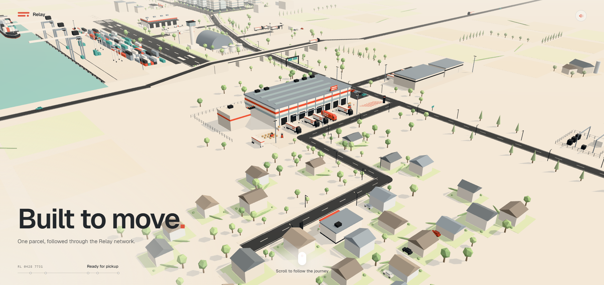

# Relay — Interactive 3D Logistics Experience

**A scroll-driven 3D logistics concept that follows one parcel through a living delivery network — from pickup to its final destination.**

[**Open Live Experience →**](https://delivery-showcase.vercel.app)

## Overview

Relay is a portfolio-first interactive web experience built to explore how a logistics or delivery brand can communicate scale, speed, infrastructure, and movement through a cinematic 3D journey instead of a conventional landing page.

As the visitor scrolls, the camera travels through one continuous stylized world: local pickup points, roads, a sorting hub, long-haul infrastructure, a wider transport network, city delivery, and the final handoff.

The environment stays active while the narrative progresses, with moving vehicles, logistics infrastructure, lighting, environmental detail, and motion layered into the scene.

## Journey

The experience follows a single parcel across the network:

**Pickup → Sorting hub → Long-haul route → Wider network → City → Final delivery**

Rather than switching between disconnected sections, the full story happens inside one shared 3D environment.

## Experience highlights

- **Scroll-driven 3D storytelling** with a camera journey synchronized to page progress.
- **Continuous logistics world** instead of separate static landing-page sections.
- **Animated delivery network** with trucks, roads, hubs, transport infrastructure, and ambient movement.
- **Cinematic camera direction** designed around visual beats and transitions.
- **Independent ambient motion** so the environment continues to feel alive while the user controls the narrative.
- **Responsive presentation** for a polished portfolio and campaign-style experience.
- **Reduced-motion considerations** for users who prefer less animation.
- **Optional sound layer** to support the atmosphere without taking control away from the visitor.
- **Performance-conscious 3D architecture** designed for a real browser experience rather than a pre-rendered video.

## Technical stack

- Next.js 16
- React 19
- TypeScript
- Tailwind CSS 4
- Three.js
- React Three Fiber
- @react-three/drei
- GSAP
- ScrollTrigger
- glTF / GLB assets
- Vercel

## Technical approach

The project separates the 3D world, camera journey, narrative timeline, ambient actors, and scroll state so each layer can evolve independently.

GSAP and ScrollTrigger coordinate the narrative progression, while Three.js and React Three Fiber render the world and its moving elements. Ambient actors continue on their own clock, which keeps the scene from feeling frozen when the user pauses or scrolls backward.

The experience is built as an interactive website first — the same scene can then be recorded for short-form social content without reducing the live version to a passive animation.

## Built for brand storytelling

Relay is intentionally structured as a concept that could be adapted for:

- logistics and delivery companies;
- transport and infrastructure businesses;
- service companies that need to visualize a process;
- campaign or launch pages;
- interactive product storytelling;
- high-impact portfolio and brand experiences.

## Demo video

A full interaction recording can be added to this showcase alongside the live experience.

Recommended file name:

`media/relay-demo.mp4`

## Brand note

**Relay is a fictional brand created for this concept project.**

This is an independent speculative design and development showcase. It does not represent commissioned work for, affiliation with, or endorsement by any real logistics company.

## Project status

The live interactive concept is available at:

**https://delivery-showcase.vercel.app**

The production source code is private. This public repository exists as a portfolio showcase with project information and visual media.

---

**Concept, design & development by Marina Merkotan**